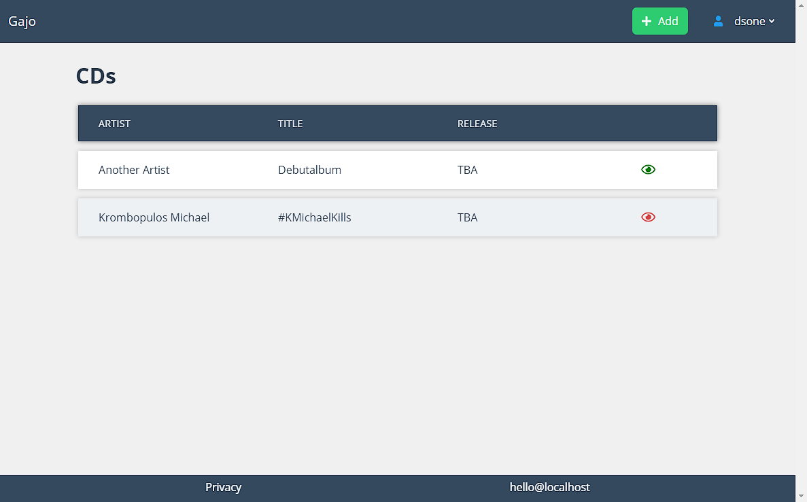
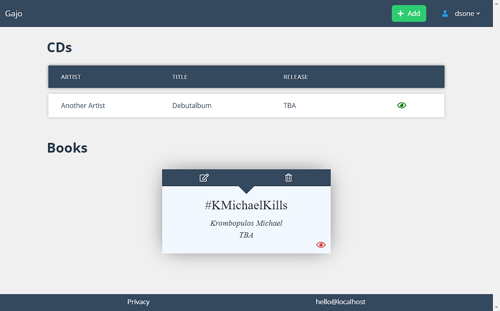

# Gajo
## About
Gajo helps you to remember any kind of releases in the future.  
Your favourite band announced their world tour at the end of the year?  
A new record in 6 months? That new fantasy movie trilogy's third part is coming out this christmas?  
Add all of those neatly categorized to your Gajo lists.  
Check your list frequently, add new releases, remove them, share your list with your friends.  

Main purpose for Gajo is to be used with a single user but it is possible to enable multi user registrations up to an optional limit of users.

## Screenshots
Everybody likes to see what they get.  Here's an example:

### Profile view

### List and/or card display for entries

### More screenshots
Take a look inside _[resources/assets/screenshots](./resources/assets/screenshots)_ for more examples!

## Philosophy
This project uses a simple approach to give you the ability to create lists and display them in a simple yet visually appealing way. There are no _bloated_ frameworks, just the necessities to get up and running quickly.

Built upon Laravel, Axios, Bulma, SVGs and plain JavaScript, saving data into an SQLite database.

## Privacy
By default, your list is only visible when you login to Gajo.  
Your user profile is set to hidden by default and not visible from the outside. The same goes for things you put on to your list.  

But you can set your profile to public and only certain list entries as hidden.  
Each list entry has three states:  

| State | Description |
|---|---|
| hidden | Only visible when you are logged in |
| private | Visible only when logged in or through your personal RSS feed link |
| public | Visible publicly |  

## Requirements
PHP >=7.1, git, composer, npm and support for SQLite.

## Installation
1. Clone the repository:  
`git clone this repo`
2. Install PHP dependencies:  
`composer install`  
3. Move the .env.example, generate an app key and enter your config:  
`mv .env.example .env`  
`php artisan key:generate`  
4. Create a database file:  
`touch database/database.sqlite`  
5. Create the tables inside the database:  
`php artisan migrate`  
6. Install JS/CSS dependencies:  
`npm install`  
7. Production build css/js:
`gulp`  

Open your browser and visit APP_URL as entered inside .env.  
Register your account that you use to login.  
Done.

**Beware**: As long as _APP_ENV_ inside .env equals exactly to "_local_", you can login to user with id = 1 with any password. This is intended for local development.
Put your APP_ENV into "_production_" or any other label and this behaviour is disabled.

## Settings
Most settings are inside .env. But to enable a multi user environment, you need to edit _config/app.php_ and the key _settings.multiUser_ and set it to `true`.  

If you run Gajo in multi user mode, perhaps change the database from SQLite to some DB system that supports parallel write access. 